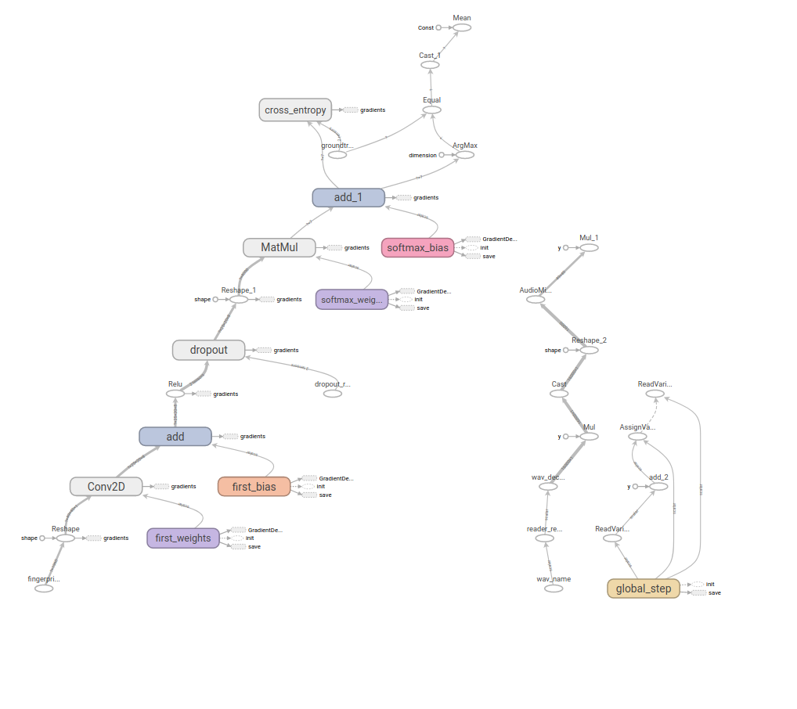

# Project Description

We have built a Machine learning model as a typical smart home device that understands and performs an action upon sensing its command from a microphone. These commands include commands to turn on and turn off home appliances such as a point of light, fan and a heater. The first step of our machine learning workflow are quite similar to those of the traditional: we collect our data, preprocess and then design and train a model using TensorFlow. The second step is to deploy our model into an embedded device. We used the Arduino NANO BLE which has a pre-installed microphone to collect an input into the model and the TFlite-Micro for Micro-controllers to run the saved Quantize Model - Model is saved with int8 parameters and accept int8 input - to perform an action.
The steps highlighted below will reproduce the workflow:
## Clone Repository
Open your Command Line or Terminal depending on your Operating System. You may create a virtual environment to isolate this project files from your local machine;
Read here for virtual environment: https://docs.python.org/3/library/venv.html. 
But for simplicity, clone this repository by runnung the command below in the terminal, line by line
```
$ mkdir tiny
$ cd tiny
$ git clone git@github.com:CSCI4850/s21-team3-project.git
$ cd s21-team3-project
```
## Installing Dependence
```
$ pip install -r requirement.txt
```

## Collecting data
We used the tensorflow's speech command dataset available in [1] and recorded more data for our specific application (on, off, fan, heater and light). To record and include more data in the dataset. open the preprocessing folder and run through the preprocess notebook
## Preprocessing
The preprcessing of the data is made using the Tensorflow's API MicrofrontEnd and this is done inside the model training. However, it is similar to those available in the preprocess notebook stated in the "Collecting Data" Phase.

## Model Architecture and Training
Training is of two Phase. Train Large model through the Large Model Directory.
Follow the Training.ipynb notebook to train an arduino deployable model (This is the Model to reproduce the Result in this research)


# Model Deployment
# Hardware Requirement
1. Arduino NANO BLE 33
2. Arduino IDE for arduino programming. 
3. Three LED LIGHTS (For Fan, Light and Heater)
4. Bread Board for connections

## Model Deployment
1. Set up Arduino IDE  for NANO BLE 33 using https://www.arduino.cc/en/Guide/NANO33BLE
    On the IDE, click "TOOLS" --> "MANAGE LIBRARIES", then search and install the following Dependence
    * Tensorflow Lite - Latest Version
    * LSM9DS1
2. open arduino source code in the Arduino BLE
    * If you have trained up your Model for deployment, You need to locate the the tfliteMicro.cc in the Model folder
    * Copy the content and navigate to the arduino source code named "micro_features_model.cpp". Paste the content inside the Curly Brackets "{}" only
    * If you also trained up your Model with different words, you need to locate the source code name "micro_features_micro_model_settings.cpp" to change your commands appropiately 
4. Wire up the Bread Board with the Led Lights
  ### PIN MODES
    * Digital Pin 4 for Light
    * Digital Pin 5 for Fan
    * Digital Pin 6 for Heater
 4. Upload skecthes to Arduino Device
 
 ### Testing
 The Device comes with an embedded Microphone so we do not have to install microphone externally. After Successfully deploying model, Speak ON or OFF and either a green light(on) or a red light(off) will come up on the arduino to indicate device raeady to perform the action. We can then speak the appliance LIGHT, FAN or HEATER and see how the device performs its action. The lights will come up as configured in the Model deployment phase
